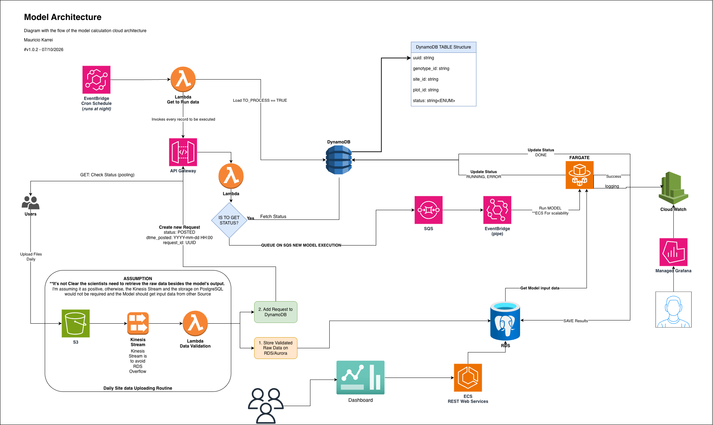

# Architecture

The discussion for each point is highghlited in _italic_ after each scenario.

#

This is the part we most want to see your systems thinking on. Write and draw, don't build. We use AWS. Design the system that would run this analysis as a managed, hands-off pipeline given the scenario below.

The scenario, concretely:

- __~12 trial sites upload phenotype files to us throughout the day. On a busy night that's on the order of 50,000 files, from a few KB to several GB each.__
_Answer: For this design, I assumed the raw data collected from the fields must be stored in a database. To achieve this, I added an S3 trigger that sends events to a Kinesis Stream connected to a Lambda function, which reads the file in chunks (to handle files of several GB). This raw data would then be stored in an RDS/Aurora database, to be later fetched by the model or even by scientists who want to access the raw data. In this first step, all data validations would be performed to guarantee that the data satisfies the input requirements. I chose to use Kinesis and a Lambda because I had already used this approach for a similar case. Although I know AWS offers AWS Batch, I don't have experience with it._

- __The pipeline runs nightly but should also pick up late-arriving files.__
_Aswer: A Cron job (using AWS EventBridge) can dispatch night events, but as it requires control  _

- __Scoring a batch can take anywhere from seconds to a couple of hours depending on panel size.__
_Answer: I chose AWS Fargate to run this task over EC2 or Lambda due to its flexibility in scaling, and because it can be turned off when not in use._

- __We must not reprocess a file we've already done, and must safely resume after a crash without double-counting.__
_Answer: During import processing, I'd create a unique UUID based on the "primary key" of the run: Genotype_id, Site_id, plot_id. Before being placed on the queue, it needs to be verified to check whether this task has already been scheduled, to avoid duplicates. This is addressed in the diagram, with the IF statement REQUEST_ID EXISTS? in the Lambda function._

- __Hundreds of scientists later query the results interactively — filtering and joining across genotypes, traits, sites, and seasons — from an internal dashboard.__
_Answer: The results should be stored in a database. In this example, I added an RDS/Aurora PostgreSQL database to store results. A REST API is adequate to retrieve model results, as well as input files. For this application, I'd suggest a scalable ECS or EKS service on EC2. It would provide flexibility to fetch different parameters and would be more adequate to customize according to the dashboard application's needs._

- __When something breaks overnight, the on-call engineer needs to find out without a human having watched it.__
_Answer: For this matter, application logging and status monitoring are adequate. A CloudWatch service offers flexibility for integration with external applications, such as Grafana. Additionally, well-documented logging can help with debugging and provide clear guidance on how to address the issue._

# Architecture

To develop the architecture and the diagram presented below, I chose not to use any external source, such as AI/LLMs (except for language and grammar corrections), to ask for recommendations or validate my thoughts, as I'd consider that unfair given the purpose of the exercise. I just wanted to clarify this because it's possible that on interview day I might find a better solution to this problem.

With this in mind, my first thought was to consider ways to process the CSV files dynamically. As I previously mentioned, I'm considering that the phenotype data will go into a database for later use. The same database will be queried by the model, deployed on Fargate.

## CSV's ingestion
In this way, the scientists/users would first upload these CSV files to an S3 bucket. Each new file triggers a Kinesis stream (used in this application to control the ingestion into the RDS/Aurora writer instance, avoiding crashes). The Kinesis stream is consumed by a Lambda function, which is responsible for reading the raw file, validating the format, checking for invalid data, and writing it to the database.

Additionally, at this moment, we create a new record in DynamoDB with status POSTED. This is processed later at night (details in the upcoming session).

## Night Routine (model's execution)
At night, an EventBridge cron task will be triggered, and a Lambda will read the DynamoDB table, filtering the inputs with status POSTED, created by the S3 ingestion step (previous step). This Lambda would simply create requests and invoke the API Gateway with a REST POST request.

I opted to use an API Gateway in the middle, thinking about future applications where the scientist could simply create a new POST request, and we could run a model without the need for the "at night" cron schedule (***this feature may not make sense for the application).

## Model triggering (API Gateway POST request)
Given the input received by the API Gateway, I opted to queue the requests as SQS messages. This option was selected due to the RunTask limit on AWS, which imposes a restriction on the number of ECS tasks that can be launched per second. Considering that a Fargate task can run for minutes or hours, a middle queue handler is necessary.

After posting the request to the SQS queue, I opted to use an EventBridge Pipe to consume the messages and launch a Fargate task to run the model. Given the example provided, Fargate would run each Phenotype in a separate launch.

In my humble opinion, this creates a parallelism layer, allowing decoupling between executions (each Phenotype run is independent, thus preventing a bad execution from blocking the entire run).

## Monitoring and posterior debug
Each step should update the STATUS attribute in DynamoDB. However, I believe error details should be explicit and handled by CloudWatch. Additionally, CloudWatch allows third-party integrations, such as Grafana, which could be used to track progress.

