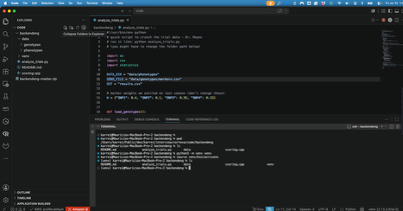
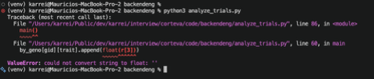
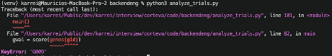
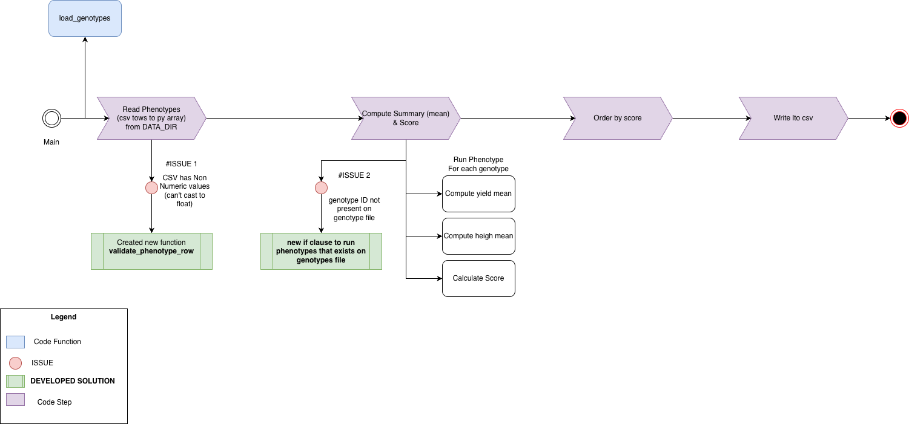
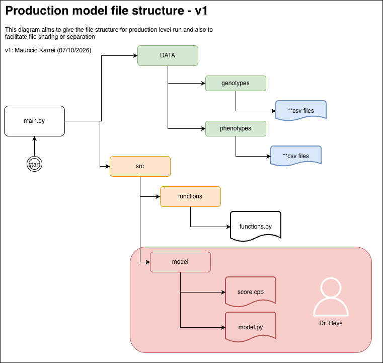

Disclaimer: To develop the reasoning behind the solutions and ideas related to this project, I considered using any AI model unfair for the purpose of this exercise. I solely used an LLM to correct grammar or misspelled words in these documents, and also to generate the build commands for compiling C++ with pybind11. Besides that, Google was used for Python syntax questions and strategies for connecting Python to C++.
The chosen approaches do not necessarily reflect the final versions. After reviewing them, I would have made modifications, but the 4 hours time was over, and I decided not to.

## Approach details
My personal strategy for solving these types of exercises is based on first understanding the broad picture and breaking it into small "actionable" pieces, adding them to a simple Kanban board. This doesn't necessarily mean I always follow this strategy, because under pressure, given urgency, or in other circumstances. In some cases, if the problem is well known or very small, I don't necessarly follow this approach.

The Kanban board I created for this project is available at: https://github.com/users/mzkarrei/projects/1/views/1 


I tried to commit most of the steps separately, according to my progress, to make my progress trackable if you'd like to verify it.
Additionally, to keep this exercise confidential, I opted not to publish it on my personal GitHub. I created a new GitHub account and made the project available at: https://github.com/mzkarrei/backendeng

## Design Document

- __What you changed and why, and what you deliberately left out.__

CHANGES
1. __Minimum Requirement to RUN:__

    Firstly, my goal was to read the code, execute and understand the inputs and outputs. From this step, I could have a better idea of the project structure, and how to approach future tasks.

    Firstly, I created a python virtual environment.
    

    Then the first issue came up:
    

    ISSUE #1: This issue was quickly resolved by creating a new function validate_phenotype_row . The goal here isn’t to be perfect, but to understand the program flow, common issues, and expected behavior.
    Fixed on Commit 47894b4 
    

    ISSUE #2: Not all genotypes from phenotypes exists on genotypes csv file.
    
    Quickly solved just by adding an if to check if gid exists on genotypes file
    Fixed on commit # 47894b4
    
    From this first execution, I also created diagram #1, available in docs/. Although in many cases these diagrams aren't necessary, I like doing them because it isn't time-consuming and it helps me a lot when communicating with other researchers (especially those from other areas, such as Dr. Reys).
    


From this first step, I had a better idea of what needed to be done to create a first MVP, which I outline in the following steps.


2. __Organized phenotype files per genotype.__
    
    1.1. As I understood it, the model only needs genotype data per phenotype, but the phenotype inputs were grouped together per site. Considering multi-GB phenotype files, this would create unnecessary scalability and organizational problems.

    1.2. I created a quick (not scalable) Python script inside the scripts folder to organize these new phenotype conversions.

3. __Project Organization__
    
    I organized the file structure according to the diagram below. In my opinion, separating model-related functions from I/O functions allows for flexibility and code legibility — i.e., Dr. Reys should be able to focus on the model without needing to be proficient in Python scripting.

    


    Additionally, I created a new output directory, saving the results per genotype.


LEFT OUT:

2. I don't believe handling CSV file reading line by line is effective when dealing with millions of genotypes/phenotypes in multi-GB files. I know there are ways to handle these tasks using chunks (AWS has Batch Processing for this), but I had never implemented it before. Due to time restrictions and the goal of the exercise, this task wasn't fully addressed.

3. Effective data validation functions (implemented just the basic validations). Further evaluation would be necessary.

4. I chose to use pybind11 library to do the integration, instead of using ctypes, which in a production environment it would be probably my choice, according to my preliminary readings (https://stackoverflow.com/questions/145270/calling-c-c-from-python, https://realpython.com/python-bindings-overview).

5. Dockerfile and production exemple setup. I opted to leave out the Dockerfile settings due to timing and priorities.


- __The C++ integration: how you bound it to Python, how data crosses the boundary, and how that holds up when scoring millions of genotypes.__

I opted to use the library pybind11. To build, I used the code:

```
c++ -O3 -Wall -shared -std=c++11 -undefined dynamic_lookup \
  $(python3 -m pybind11 --includes) \
  src/model/scoring.cpp \
  -o scoring$(python3-config --extension-suffix)
```
Please observe I'm compiling from the root of the project, and the cpp file is located at src/model/scoring.cpp


- __Dependability: What are the top ways this fails in production over a year of running, and what would you do about them?__
- First, well-documented processes would certainly help in this scenario. Maybe another teammate would be the one handling the issues, and good documentation is one of the first things they'll look for.

- Investigate whether the file structure has changed. The validation logic might not be suitable for new phenotypes or genotypes (look for additional columns/data types in the input files).

- Look for stuck processes in Fargate, or issues with SQS/EventBridge calls.

- Considering the project's growth, it's reasonable to expect that the database (RDS/Postgres) could get stuck due to indexing issues, or that new reader instances might be needed.

- Clear old DynamoDB records.


- __If you had another day, what would you do next?__

1. Reconsider/revise the genotype inputs and reruns. Maybe the outputs should be saved in a more appropriate way.

2. Think more carefully and do some research regarding my S3 file ingestion strategy. Maybe a more effective approach would simplify the process.

3. Think more carefully about the model trigger on EventBridge. To be honest, I don't think it's the best approach (I believe I overcomplicated it, but I'll revise). Maybe SQS and two Lambdas to handle POST requests wouldn't be necessary. Additionally, considering the need to run at a fixed time at night, my strategy of using a cron schedule wouldn't resolve the issue of processing "late requests" without running the cron again.


- __(Optional, a few sentences — no implementation) Looking ahead with AI: We expect to use LLMs and possibly agentic workflows to make this pipeline more useful to scientists. Where would you apply AI here, and — just as important — where would you deliberately not? We're interested in your instincts; there's no wrong answer, and skipping this won't count against you.__

To answer this question, the first thing that came to my mind was: how would the LLM actually be used here? I stopped for a couple of minutes to think about it and tried to put myself in Dr. Reys' shoes: if I were him, what would I actually want to ask a model, and what kind of answer would be useful to me as a scientist, not just as a demo?

Given the data available (height x width x SNPs), I imagined a few questions a researcher like Dr. Reys might ask, ranging from simple lookups ("What genotypes were tested at site X last season?") to more analytical requests ("Compare the growth trend of genotype G003 across the last 5 seasons").

Later on, the model might answer in a table format, and I might also want to connect other variables, such as weather, for instance (just guessing).

I believe using an LLM would be totally feasible, but it would require some project adaptations.

First, AI models need reliable data to produce reliable results. Then I'd raise questions such as:
1. Do I want to use an LLM to explore my genotype testing within the model?
2. Do I want to validate my models still under development (in which case I'd focus more on data already validated by scientists)?

I believe the challenges and limitations would be more around the LLM strategy than the tech layer itself.

In terms of technology, to run an LLM in a similar architecture, I'd need to create a specific "read-only" table schema for the model to connect to. However, my first concern is that under high-rate usage, some type of caching would be necessary to handle large-scale processing.

I know AWS offers technologies such as Bedrock that can connect to a database and generate SQL queries based on requirements. However, I've never dug into these technologies (although I'd love to).

I believe my answer to this question was a little broad, but the message I tried to convey is more about "what the model is supposed to answer" than about the technology layer itself.